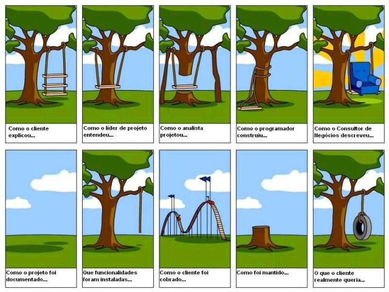

# Técnicas de Elicitação de Requisitos

A aplicação de técnicas estruturadas na Engenharia de Software é fundamental para garantir eficiência, qualidade e alinhamento com as necessidades reais dos stakeholders. Métodos bem-definidos ajudam a evitar ambiguidades, reduzir retrabalho e facilitar a comunicação entre equipes multidisciplinares. Seja na elicitação de requisitos, no design de soluções ou na validação de protótipos, o uso de técnicas adequadas transforma desafios complexos em processos organizados e resultados tangíveis. 

<b>Figura 1: Imagem clássica sobre diferentes visões de um requisito</b>

Fonte: Disponível em [DevMedia](https://www.devmedia.com.br/engenharia-de-requisitos-introducao-e-certificacao/28058)

A seguir, serão apresentadas algumas das principais técnicas utilizadas por profissionais da área, destacando seus objetivos e benefícios:

## 1.0 Entrevista

Vários aspectos devem ser considerados ao conduzir uma entrevista com partes interessadas. Em primeiro lugar, é essencial definir claramente o objetivo da entrevista e, se necessário, preparar um roteiro com perguntas que servirão como base para a conversa. Além disso, é importante planejar os materiais que serão utilizados, como gravador, papel e caneta, e decidir se o próprio engenheiro de requisitos fará as perguntas ou se um assistente será envolvido.

O comportamento do entrevistador também é crucial: ser polido, educado e profissional pode fazer toda a diferença no sucesso da entrevista. Esses critérios, entre outros, contribuem para uma entrevista eficaz.

## 2.0 Prototipação

A prototipação é uma técnica valiosa que ajuda a equipe a visualizar os requisitos e como eles funcionarão na prática. Se algum requisito não for atendido corretamente ou for esquecido, o protótipo facilita sua identificação. Além disso, um protótipo permite explorar diferentes versões da solução, incentivando a criatividade e a inovação.

Essa técnica não é útil apenas para a elicação de requisitos, mas também para a validação, garantindo que o produto final atenda às expectativas das partes interessadas.

## 3.0 Observação

Antes de iniciar a observação, é fundamental: Definir os objetivos claramente, selecionar o grupo a ser observado, estabelecer o tempo de duração da observação.

A observação é especialmente indicada quando as partes interessadas têm dificuldade em expressar suas necessidades em uma entrevista.

### Possíveis problemas:

Se o ambiente de trabalho sofre interferências externas que alteram a rotina real, a observação pode se tornar ineficaz.

### Tipos de observação:

Passiva: O observador não interfere no processo, apenas registra as atividades e faz questionamentos ao final.

Ativa: O observador interage durante o processo, fazendo perguntas e participando ativamente.

## 4.0 Brainstorming

O brainstorming é uma técnica de geração de ideias em que, inicialmente, nenhuma ideia deve ser descartada ou julgada como boa ou ruim. Recomendações para um brainstorming eficaz:

* Envolver pessoas de diferentes áreas para diversificar as perspectivas.

* Garantir que participantes de menor hierarquia se sintam à vontade para contribuir.

* Manter o foco no assunto principal, evitando desvios.

### Método de Classificação

As ideias mais recorrentes ou mais votadas pelo grupo devem ser priorizadas.

### Técnicas complementares:

* Suposição Invertida: Questionar pressupostos para estimular novas ideias.

* Scamper: Substituir, Combinar, Adaptar, Modificar, Propor novos usos, Eliminar ou Reorganizar ideias existentes.

* Storyboarding: Representação em sequência visual de cenários para identificar fluxos e requisitos ocultos.

* Role Storming: Geração de ideias assumindo papéis distintos (ex.: cliente, desenvolvedor).

## 5.0 Workshop

O workshop é semelhante ao brainstorming, compartilhando algumas técnicas, mas com diferenças importantes:

* É mais estruturado e aprofundado.

* Geralmente tem duração maior.

* Envolve dinâmicas e debates guiados por um facilitador.

### Como conduzir:

O facilitador apresenta conceitos e propõe atividades e o grupo discute colaborando na construção de propostas.
Essa abordagem é ideal para soluções complexas que exigem análise detalhada e participação ativa das partes interessadas.

## 6. Referências

> Ian Sommerville  *Engenharia de Software*. tradução Ivan Bosnic e Kalinka G. de O. Gonçalves ; revisão técnica Kechi Hirama. — 9. ed. — São Paulo : Pearson. Disponível em: <https://www.facom.ufu.br/~william/Disciplinas%202018-2/BSI-GSI030-EngenhariaSoftware/Livro/engenhariaSoftwareSommerville.pdf>. Acesso em: 20 abr. 2025.

>  Carlos Eduardo Vazquez, Guilherme Siqueira Simões  *Engenharia de Requisitos Software Orientado ao Negócio*. Copyright© 2016 por Brasport Livros e Multimídia Ltda. Disponível em: <https://analisederequisitos.com.br/wp-content/uploads/2023/06/engenharia-de-requisitos-software-orientado-ao-negocio.pdf>. Acesso em: 13 abr. 2025.

## 7. Histórico de Versões

| Versão |Descrição     |Autor                                       |Data    |Revisor|
|:-:     | :-:          | :-:                                        | :-:        |:-:|
|1.0     |Criação da Aba|[Letícia](https://github.com/LeticiaMonteiroo)| 20/04/2025 |[Gabriel Pinto](https://github.com/GabrielSPinto)|
