# Questionário

## 1. Introdução

Os questionários são uma técnica de elicitação de requisitos que consiste na aplicação de formulários estruturados ou semiestruturados com perguntas destinadas a extrair informações relevantes dos usuários ou stakeholders. Essa abordagem permite coletar dados de um grande número de pessoas de forma padronizada, promovendo uma visão mais ampla das necessidades e expectativas em relação ao software.

## 2. Metodologia

O questionário foi conduzido pelos membros [Caio Duarte](https://github.com/caioduart3), [Gabriel Pinto](https://github.com/GabrielSPinto), [João Moreira](https://github.com/joaofmoreiraa), [Laryssa Felix](https://github.com/felixlaryssa), [Leticia Monteiro](https://github.com/LeticiaMonteiroo), [Ludmila Aysha](https://github.com/ludmilaaysha) e [Mayara Marques](https://github.com/maymarquee). O questionário aplicado obteve um total de 21 respostas. No entanto, apenas 10 respostas foram consideradas válidas, por se tratarem de usuários reais do sistema em questão. As demais 11 respostas foram desconsideradas nesse contexto, uma vez que foram fornecidas por indivíduos que não utilizam o aplicativo, portanto, não contribuem de forma significativa para a coleta de requisitos relevantes. Após essa etapa, os requisitos elicitados foram consolidados em uma tabela referente aos Requisitos Funcionais. Abaixo, apresentamos os participantes e o cronograma de aplicação da técnica.

### 2.1. Cronograma

Tabela 1: Participantes.

| Nome                                                                 | Data       | Hora  | Função |
|----------------------------------------------------------------------|------------|--------| ------------ |
| [Caio Duarte](https://github.com/caioduart3)                        | 23/04/2025 | 16:05 | Confeccionista e analista | 
| [Gabriel Pinto](https://github.com/GabrielSPinto)                   | 23/04/2025 | 16:05 | Confeccionista e analista | 
| [João Moreira](https://github.com/joaofmoreiraa)                    | 23/04/2025 | 16:05 | Confeccionista e analista | 
| [Laryssa Felix](https://github.com/felixlaryssa)                    | 23/04/2025 | 16:05 | Confeccionista e analista | 
| [Leticia Monteiro](https://github.com/LeticiaMonteiroo)             | 23/04/2025 | 16:05 | Confeccionista e analista | 
| [Ludmila Aysha](https://github.com/ludmilaaysha)                    | 23/04/2025 | 16:05 | Confeccionista e analista | 
| [Mayara Marques](https://github.com/maymarquee)                     | 23/04/2025 | 16:05 | Confeccionista e analista | 

Fonte: [Caio Duarte](https://github.com/caioduart3), [Gabriel Pinto](https://github.com/GabrielSPinto), [João Moreira](https://github.com/joaofmoreiraa), [Laryssa Felix](https://github.com/felixlaryssa), [Leticia Monteiro](https://github.com/LeticiaMonteiroo), [Ludmila Aysha](https://github.com/ludmilaaysha) e [Mayara Marques](https://github.com/maymarquee).

### 2.2. Questionário

As perguntas a seguir compõem o questionário desenvolvido com o intuito de coletar informações dos usuários sobre suas necessidades e expectativas em relação ao sistema. O questionário pode ser acessado [aqui](https://forms.gle/2gfxSZiuzrrvkjqw5)

<b>Figura 1: Seção 1</b>

<b>Figura 2: Seção 2</b>

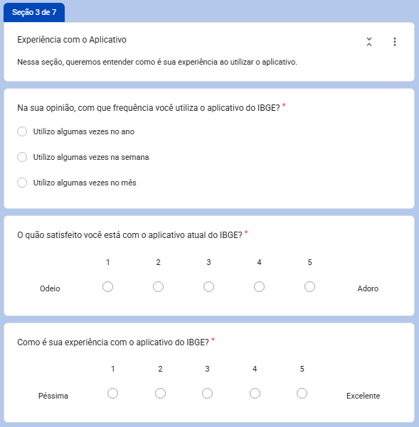

<b>Figura 3: Seção 3</b>

<b>Figura 4: Seção 4 1/2</b>

<b>Figura 5: Seção 4 2/2</b>

<b>Figura 6: Seção 5</b>

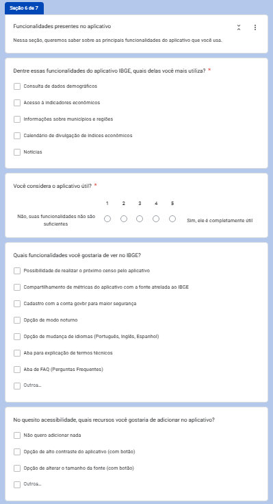

<b>Figura 7: Seção 6</b>

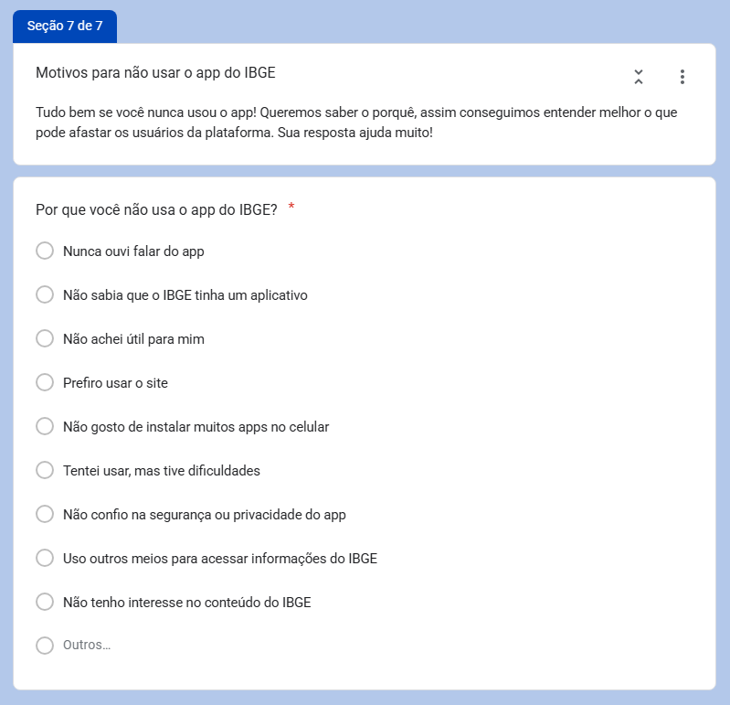

<b>Figura 8: Seção 7</b>

### 2.3. Respostas

Os gráficos a seguir apresentam a distribuição das respostas fornecidas pelos usuários considerados válidos para a elicitação de requisitos

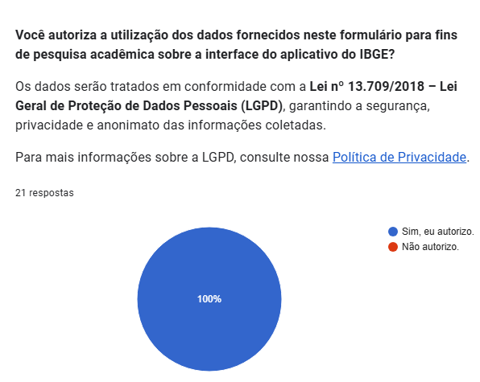  

<b>Figura 9: Resposta da primeira pergunta do questionário.</b>

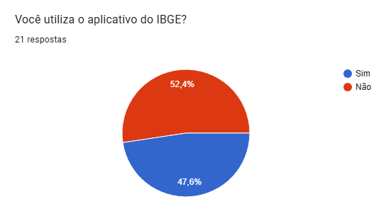  

<b>Figura 10: Resposta da segunda pergunta do questionário.</b>

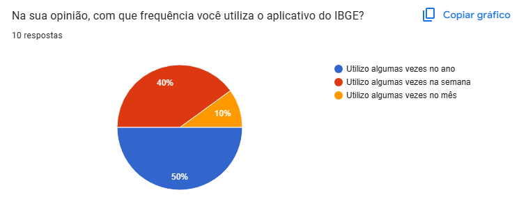  

<b>Figura 11: Resposta da terceira pergunta do questionário.</b>

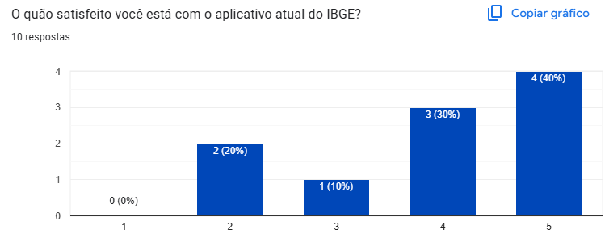  

<b>Figura 12: Resposta da quarta pergunta do questionário.</b>

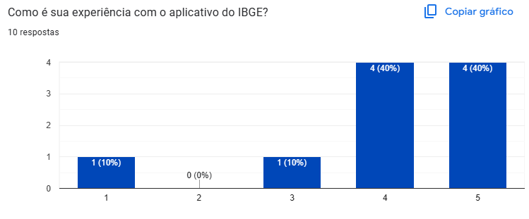  

<b>Figura 13: Resposta da quinta pergunta do questionário.</b>

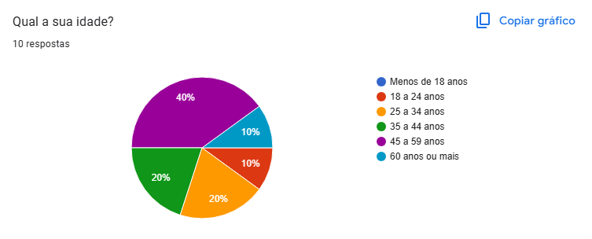  

<b>Figura 14: Resposta da sexta pergunta do questionário.</b>

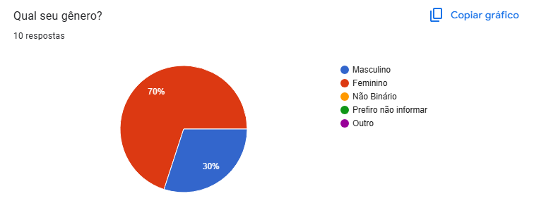  

<b>Figura 15: Resposta da sétima pergunta do questionário.</b>

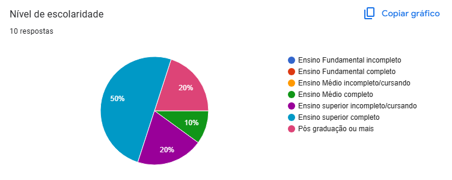  

<b>Figura 16: Resposta da oitava pergunta do questionário.</b>

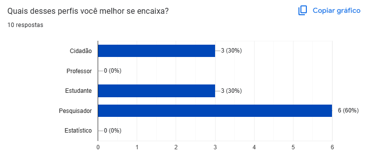  

<b>Figura 17: Resposta da nona pergunta do questionário.</b>

  

<b>Figura 18: Resposta da décima pergunta do questionário.</b>

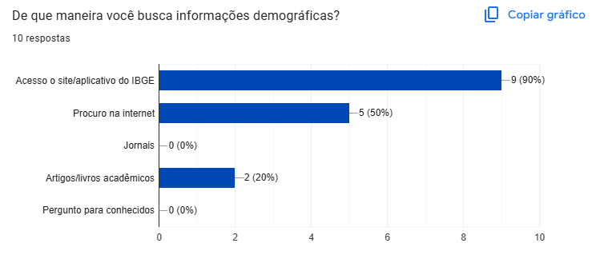  

<b>Figura 19: Resposta da décima primeira pergunta do questionário.</b>

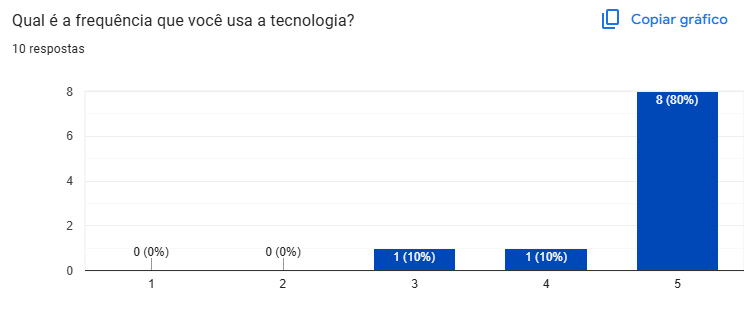  

<b>Figura 20: Resposta da décima segunda pergunta do questionário.</b>

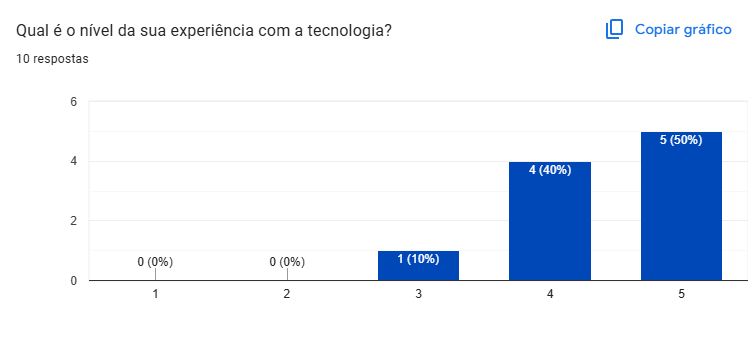  

<b>Figura 21: Resposta da décima terceira pergunta do questionário.</b>

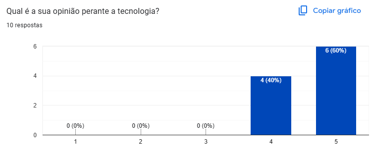  

<b>Figura 22: Resposta da décima quarta pergunta do questionário.</b>

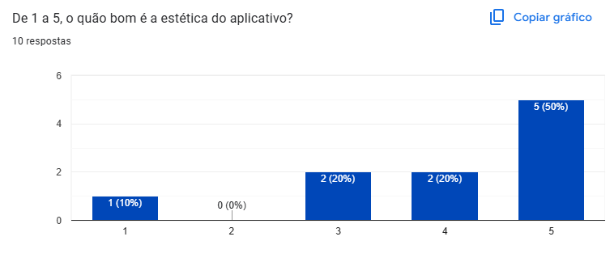  

<b>Figura 23: Resposta da décima quinta pergunta do questionário.</b>

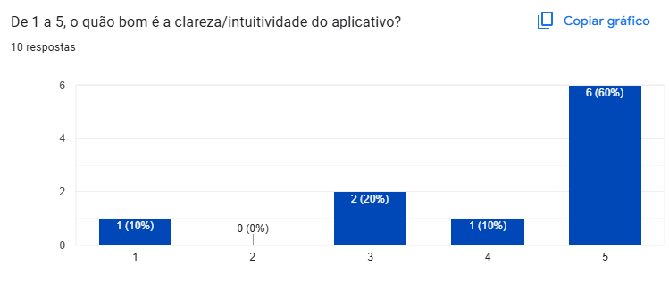  

<b>Figura 24: Resposta da décima sexta pergunta do questionário.</b>

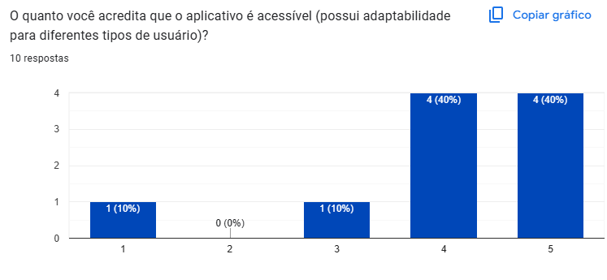  

<b>Figura 25: Resposta da décima sétima pergunta do questionário.</b>

  

<b>Figura 26: Resposta da décima oitava pergunta do questionário.</b>

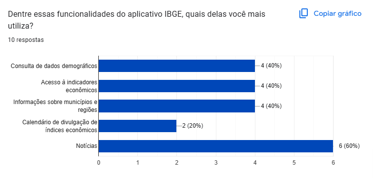  

<b>Figura 27: Resposta da décima nona pergunta do questionário.</b>

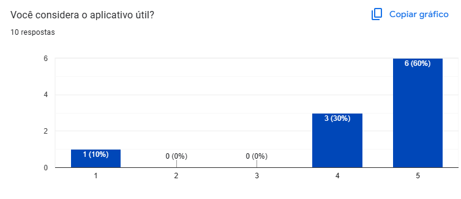  

<b>Figura 28: Resposta da vigésima pergunta do questionário.</b>

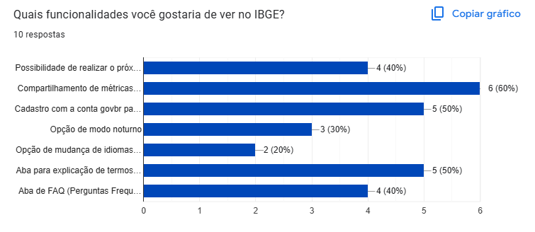  

<b>Figura 29: Resposta da vigésima primeira pergunta do questionário.</b>

  

<b>Figura 30: Resposta da vigésima segunda pergunta do questionário.</b>

  

<b>Figura 31: Resposta da vigésima terceira pergunta do questionário.</b>

### 2.4. Gravação
A gravação analisando as perguntas do questionário pode ser acessado abaixo.
<iframe width="560" height="315" src="https://www.youtube.com/embed/rwdjrZ9rKWQ?si=f9Xk56M85irlpIT_" title="YouTube video player" frameborder="0" allow="accelerometer; autoplay; clipboard-write; encrypted-media; gyroscope; picture-in-picture; web-share" referrerpolicy="strict-origin-when-cross-origin" allowfullscreen></iframe>

## 3. Requisitos elicitados

Tabela 2: Requisitos Funcionais.

|  Tipo | Descrição                                                                                                     | ID   | Implementado |
| ---- | ------------------------------------------------------------------------------------------------------------- | ---- | ------------- |
| RFQ01 |Compartilhamento de métricas do aplicativo com a fonte atrelada ao IBGE                                             | IS01 | Não           |
| RFQ02 |Cadastro com a conta govbr para maior segurança                                                       | IS02 | Não           |
| RFQ03 | Aba para explicação de termos técnicos | IS03 | Não           |
| RFQ04 | Possibilidade de realizar o próximo censo pelo aplicativo | IS04 | Não           |
| RFQ05 | Aba para explicação de termos técnicos             | IS05 | Não           |
| RFQ06 | Opção de modo noturno                               | IS06 | Não           |
| RFQ07 | Opção de mudança de idiomas (Português, Inglês, Espanhol)                                     | IS07 | Não           |
| RFQ08 | Opção de alterar o tamanho da fonte (com botão)  | IS08 | Não           |
| RFQ09 | Opção de alto contraste do aplicativo (com botão)| IS09 | Não           |

Fonte: [Caio Duarte](https://github.com/caioduart3), [Gabriel Pinto](https://github.com/GabrielSPinto), [João Moreira](https://github.com/joaofmoreiraa), [Laryssa Felix](https://github.com/felixlaryssa), [Leticia Monteiro](https://github.com/LeticiaMonteiroo), [Ludmila Aysha](https://github.com/ludmilaaysha) e [Mayara Marques](https://github.com/maymarquee).

## 4. Bibliografia

> VAZQUEZ, Carlos Eduardo; SIMÕES, Guilherme Siqueira. Engenharia de requisitos: software orientado ao negócio. 1. ed. Rio de Janeiro: Brasport, 2017. p. 176. Acesso em: 03/05/2025.

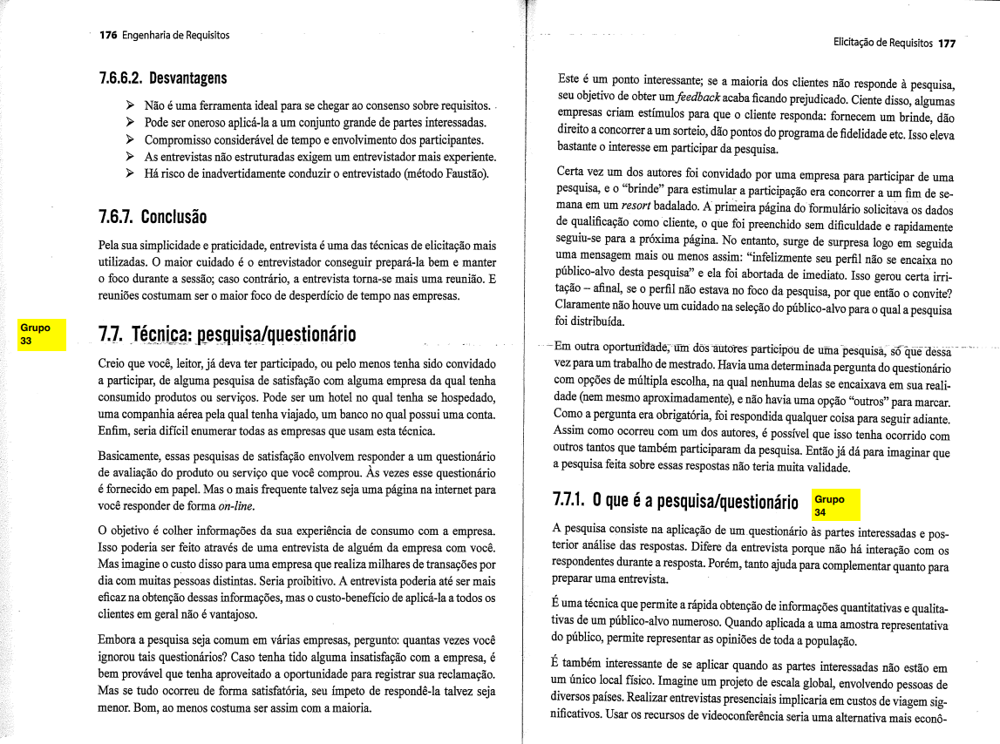  

## 5. Histórico de Versões

Tabela 7: Histórico de Versões
 

| Versão |Descrição     |Autor                                       |Data    |Revisor|
|:-:     | :-:          | :-:                                        | :-:        |:-:|
|1.0   |Criação do documento|[João Moreira](https://github.com/joaofmoreiraa)| 02/05/2025 |  [Leticia Monteiro](https://github.com/LeticiaMonteiroo) |
|1.1   |Inserção das respostas do questionário|[João Moreira](https://github.com/joaofmoreiraa)| 03/05/2025 |  [Leticia Monteiro](https://github.com/LeticiaMonteiroo) |
|1.2   |Complemento tabela de cronograma|[Mayara Marques](https://github.com/maymarquee)| 06/05/2025 |  [Larysssa Felix](https://github.com/felixlaryssa) |

Fonte: [Caio Duarte](https://github.com/caioduart3), [Gabriel Pinto](https://github.com/GabrielSPinto), [João Félix](https://github.com/joaofmoreiraa), [Larysssa Felix](https://github.com/felixlaryssa), [Letícia Monteiro](https://github.com/LeticiaMonteiroo), [Ludmila Nunes](https://github.com/ludmilaaysha) e [Mayara Marques](https://github.com/maymarquee), 2025.
 