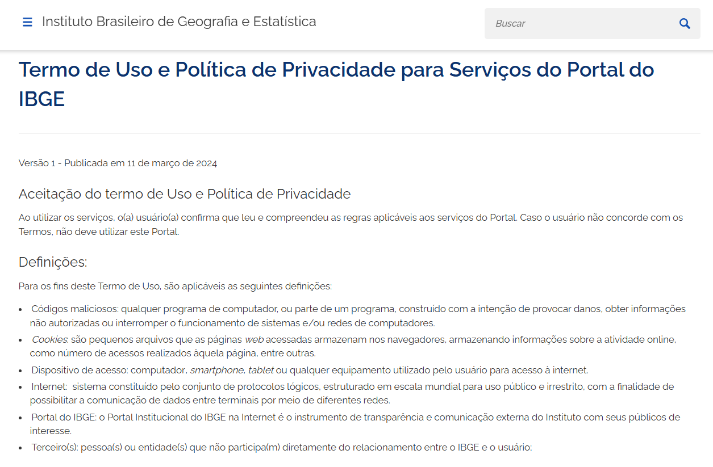
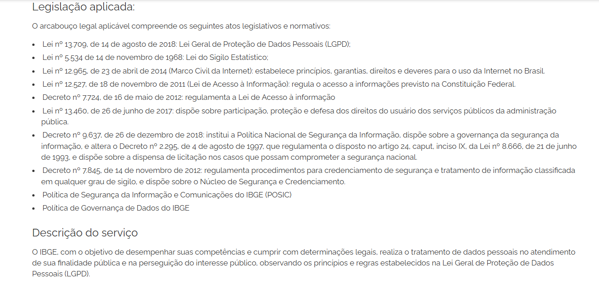
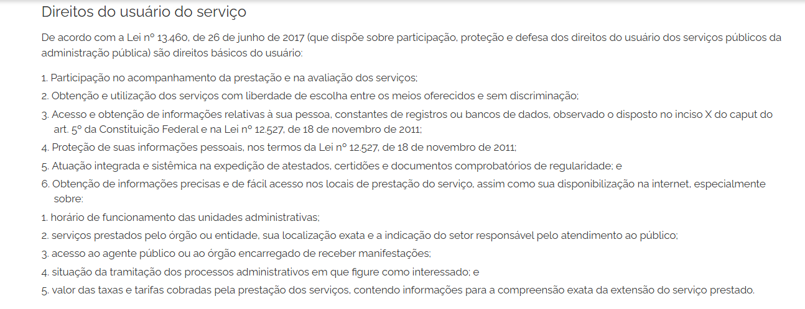
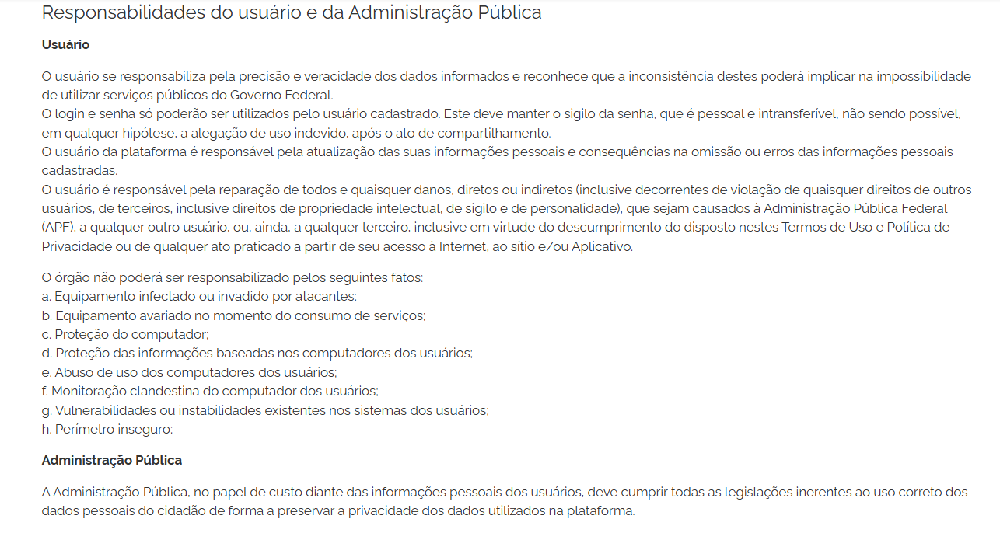
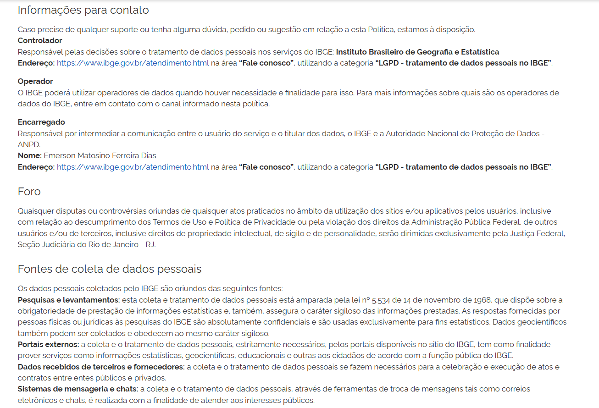
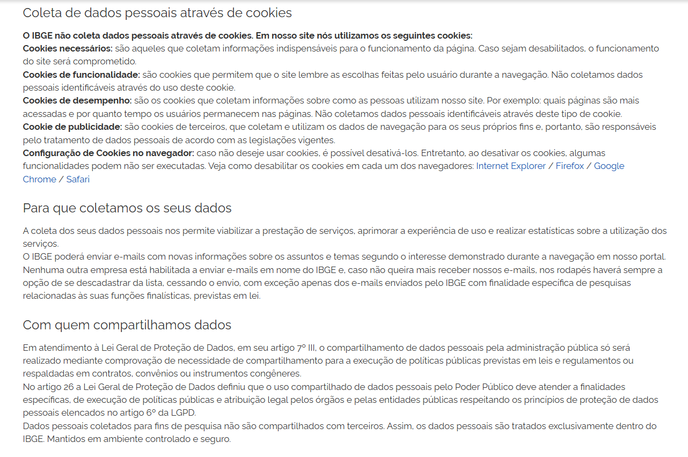

# IBGE - Instituto Brasileiro de Geografia e Estatística

<b>Figura 1: Logo do IBGE</b>

Fonte: Disponível em [www.ibge.gov.br](https://www.ibge.gov.br)

Esta página é dedicada à documentação de todos os artefatos produzidos pelo Grupo 05 na disciplina de Requisitos de Software, ministrada pelo professor André Barros, na Faculdade de Ciência e Tecnologia em Engenharia (FCTE-UnB), durante o 1º semestre de 2025. 
 

O aplicativo do IBGE é uma ferramenta governamental que oferece acesso rápido e gratuito a uma vasta gama de dados estatísticos, geográficos, demográficos e socioeconômicos do Brasil. Ele é amplamente utilizado por cidadãos, estudantes, pesquisadores, jornalistas, gestores públicos e profissionais de diversas áreas, contribuindo significativamente para a tomada de decisões baseada em dados e para a compreensão da realidade brasileira.

## 1. Objetivo 

O objetivo deste projeto é realizar uma avaliação detalhada dos requisitos funcionais e não funcionais do aplicativo oficial do Instituto Brasileiro de Geografia e Estatística (IBGE).

## 2. Justificativa

A escolha do aplicativo do IBGE como objeto de análise nesta disciplina se deu por ele atender a todos os critérios estabelecidos: é um aplicativo governamental, possui também uma versão mobile (app) e está disponível ao público em geral. 
 

Além disso, optamos por essa aplicação por não se tratar de um sistema excessivamente complexo, o que facilita o desenvolvimento das atividades propostas na disciplina e permite uma compreensão mais rápida e eficiente de suas funcionalidades. 

 

O aplicativo apresenta funcionalidades bem estruturadas, cumprindo seu objetivo principal de fornecer informações estatísticas e geográficas de forma acessível. No entanto, identificamos, tanto por meio da análise de comentários de usuários quanto pela experiência prática dos membros do grupo, que há possibilidades de melhorias, especialmente em termos de usabilidade, navegação e acessibilidade. 

 

Um ponto positivo adicional é que, ao longo do processo de elicitação, poderemos entrevistar possíveis usuários reais do aplicativo dentro da própria universidade. Alunos da UnB dos cursos de Estatística, Sociologia, Economia, entre outros, podem contribuir como entrevistados por utilizarem ou terem interesse nos dados oferecidos pela plataforma, que é útil tanto para usuários comuns quanto para pesquisadores e estudantes.  

 

Dessa forma, a escolha do app do IBGE representa uma excelente oportunidade de aplicar os conceitos da Engenharia de Requisitos em um sistema real e acessível ao nosso contexto universitário.

 

<i> Fonte: GRUPO 05. Artefato de requisitos. Disciplina de Requisitos de Software, ministrada pelo Prof. André Barros – FCTE/UnB, 1º semestre de 2025.</i>

## 3. Termo de Uso e Política de Privacidade

Para uso acadêmicos e de estudo, não foi encontrado nenhuma proibição de uso e análise do aplicativo nos Termos de Uso e a Política de Privacidade disponibilizado pelo IBGE. Isso significa que, desde que respeitados os princípios legais e éticos, como a proteção de dados pessoais e ausência de uso comercial não autorizado, é permitido examinar e explorar funcionalidades do aplicativo com objetivos educacionais e de pesquisa. Nas figuras de 2 a 7, é possível observar fotos do Termo de Uso e Política de Privacidade encontrados no site do IBGE. 

__Figura 2:__ Termo de Uso e Política de Privacidade. 1/6

__Fonte:__ [IBGE](https://www.ibge.gov.br/acesso-informacao/acoes-e-programas/politica-de-privacidade.html), 2025. 

__Figura 3:__ Termo de Uso e Política de Privacidade. 2/6

__Fonte:__ [IBGE](https://www.ibge.gov.br/acesso-informacao/acoes-e-programas/politica-de-privacidade.html), 2025. 

__Figura 4:__ Termo de Uso e Política de Privacidade. 3/6

__Fonte:__ [IBGE](https://www.ibge.gov.br/acesso-informacao/acoes-e-programas/politica-de-privacidade.html), 2025. 

__Figura 5:__ Termo de Uso e Política de Privacidade. 4/6

__Fonte:__ [IBGE](https://www.ibge.gov.br/acesso-informacao/acoes-e-programas/politica-de-privacidade.html), 2025. 

__Figura 6:__ Termo de Uso e Política de Privacidade. 5/6

__Fonte:__ [IBGE](https://www.ibge.gov.br/acesso-informacao/acoes-e-programas/politica-de-privacidade.html), 2025. 

__Figura 7:__ Termo de Uso e Política de Privacidade. 6/6

__Fonte:__ [IBGE](https://www.ibge.gov.br/acesso-informacao/acoes-e-programas/politica-de-privacidade.html), 2025. 

## 4. Integrantes

Tabela 1: Integrantes do grupo
 

<table align="center">
  <tr>
    <td align="center">
       
      <b><a href="https://github.com/caioduart3">Caio Duarte</a></b> 
    </td>
    <td align="center">
       
      <b><a href="https://github.com/GabrielSPinto">Gabriel Santos</a></b> 
    </td>
    <td align="center">
       
      <b><a href="https://github.com/joaofmoreiraa">João Félix</a></b> 
    </td>
    <td align="center">
       
      <b><a href="https://github.com/felixlaryssa">Laryssa Félix</a></b> 
    </td>
    <td align="center">
       
      <b><a href="https://github.com/LeticiaMonteiroo">Leticia Monteiro</a></b> 
    </td>
    <td align="center">
       
      <b><a href="https://github.com/ludmilaaysha">Ludmila Aysha</a></b> 
    </td>
    <td align="center">
       
      <b><a href="https://github.com/maymarquee">Mayara Marques</a></b> 
    </td>
  </tr>

</table>

Fonte: [Caio Duarte](https://github.com/caioduart3), [Gabriel Pinto](https://github.com/GabrielSPinto), [João Félix](https://github.com/joaofmoreiraa), [Larysssa Felix](https://github.com/felixlaryssa), [Letícia Monteiro](https://github.com/LeticiaMonteiroo), [Ludmila Nunes](https://github.com/ludmilaaysha) e [Mayara Marques](https://github.com/maymarquee), 2025.
 

## 5. Referências
>INSTITUTO BRASILEIRO DE GEOGRAFIA E ESTATÍSTICA (IBGE). **Termo de uso e política de privacidade para serviços do Portal do IBGE**. 2025. Disponível em: [https://www.ibge.gov.br/acesso-informacao/acoes-e-programas/politica-de-privacidade.html%E2%80%8B](https://www.ibge.gov.br/acesso-informacao/acoes-e-programas/politica-de-privacidade.html%E2%80%8B). Acesso em: 13 abr. 2025.

## 6. Histórico de Versões

Tabela 2: Histórico de versões

| Versão |Descrição     |Autor                                       |Data    |Revisor|
|:-:     | :-:          | :-:                                        | :-:        |:-:|
|1.0     |Criação da documento|[Caio Duarte](https://github.com/caioduart3)| 06/04/2025 | [Letícia Monteiro](https://github.com/LeticiaMonteiroo)  |
|1.1     |Apresentação e Objetivo|[Letícia Monteiro](https://github.com/LeticiaMonteiroo)| 12/04/2025 | [Caio Duarte](https://github.com/caioduart3)| 12/04/2025 |
|1.2     |Termos de Uso e Política de Privacidade|[Caio Duarte](https://github.com/caioduart3)| 12/04/2025 | [Letícia Monteiro](https://github.com/LeticiaMonteiroo)  |
|1.3     |Justificativa|[Letícia Monteiro](https://github.com/LeticiaMonteiroo)| 12/04/2025 | [Caio Duarte](https://github.com/caioduart3)  |
|1.4     |Alteração no tema do artefato|[Mayara Marques](https://github.com/maymarquee)| 12/04/2025 | [Caio Duarte](https://github.com/caioduart3)  |
|1.5     |Adequação às normas ABNT|[Mayara Marques](https://github.com/maymarquee)| 13/04/2025 | [João Félix](https://github.com/joaofmoreiraa)  |
|1.6     |Adição de fotos dos Termos de Uso e Privacidade do sistema|[João Félix](https://github.com/joaofmoreiraa)| 17/04/2025 | [Mayara Marques](https://github.com/maymarquee)  |
|1.7     |Ajustes nas legendas e fontes|[Mayara Marques](https://github.com/maymarquee)| 17/04/2025 | [João Félix](https://github.com/joaofmoreiraa)  |

Fonte: [Caio Duarte](https://github.com/caioduart3), [Gabriel Pinto](https://github.com/GabrielSPinto), [João Félix](https://github.com/joaofmoreiraa), [Larysssa Felix](https://github.com/felixlaryssa), [Letícia Monteiro](https://github.com/LeticiaMonteiroo), [Ludmila Nunes](https://github.com/ludmilaaysha) e [Mayara Marques](https://github.com/maymarquee), 2025.

